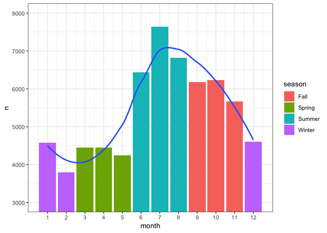
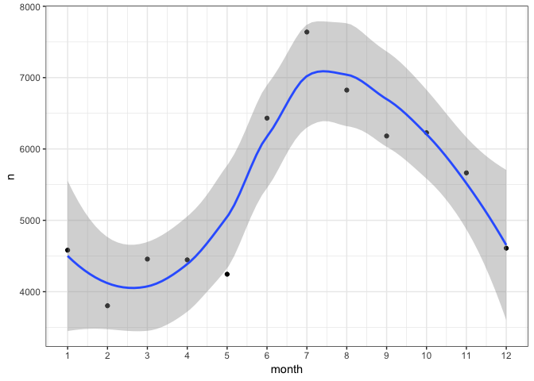
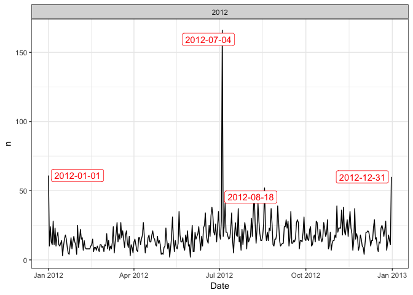

R Notebook
================

This is an
[Datasets](https://www.kaggle.com/rtatman/fun-beginner-friendly-datasets)
Notebook. When you execute code within the notebook, the results appear
beneath the code.

  - First, let’s import the dataset that we
selected:

<!-- end list -->

``` r
d <- read.csv("/Users/khaled/Desktop/Programming/Teaching/Datasets/scrubbed.csv", na.strings = "", stringsAsFactors = F) %>% filter(country == "us")
```

``` r
d %>% count(state, sort = T)
```

    ## # A tibble: 52 x 2
    ##    state     n
    ##    <chr> <int>
    ##  1 ca     8912
    ##  2 wa     3966
    ##  3 fl     3835
    ##  4 tx     3447
    ##  5 ny     2980
    ##  6 il     2499
    ##  7 az     2414
    ##  8 pa     2366
    ##  9 oh     2275
    ## 10 mi     1836
    ## # … with 42 more rows

``` r
d %>% count(shape, sort = T) 
```

    ## # A tibble: 29 x 2
    ##    shape         n
    ##    <chr>     <int>
    ##  1 light     13473
    ##  2 triangle   6549
    ##  3 circle     6118
    ##  4 fireball   5148
    ##  5 unknown    4567
    ##  6 other      4466
    ##  7 sphere     4347
    ##  8 disk       4121
    ##  9 oval       3032
    ## 10 formation  1990
    ## # … with 19 more rows

``` r
d %>% separate(datetime, c("Date", "Time"), sep = " ") -> d
d %>% count(Date, sort = T)
```

    ## # A tibble: 9,818 x 2
    ##    Date           n
    ##    <chr>      <int>
    ##  1 7/4/2010     183
    ##  2 7/4/2012     166
    ##  3 11/16/1999   161
    ##  4 7/4/2013     158
    ##  5 7/4/2011     132
    ##  6 9/19/2009    110
    ##  7 1/1/2014      89
    ##  8 10/31/2004    80
    ##  9 12/31/2013    79
    ## 10 7/4/2009      74
    ## # … with 9,808 more rows

``` r
d %>% mutate(Date = mdy(Date)) %>% mutate_at(vars(Date), funs(year, month, day)) -> d
```

    ## Warning: funs() is soft deprecated as of dplyr 0.8.0
    ## please use list() instead
    ## 
    ##   # Before:
    ##   funs(name = f(.))
    ## 
    ##   # After: 
    ##   list(name = ~ f(.))
    ## This warning is displayed once per session.

``` r
d %>% mutate(
    season = case_when(
      month %in% 9:11 ~ "Fall",
      month %in% c(12,1,2)  ~ "Winter",
      month %in%  3:5  ~ "Spring",
      TRUE ~ "Summer")) -> d

d %>% count(year, sort = T) %>% ggplot(aes(year, n)) + geom_col()
```

<!-- -->

``` r
d %>% group_by(month) %>% mutate(n = n()) %>% select(month, n , season) %>% distinct() %>% 
  ggplot(aes(month, n)) + geom_col(aes(fill = season)) + scale_x_continuous(breaks = 1:12) +
  coord_cartesian(ylim=c(3000,8000)) + geom_smooth(se = F)
```

    ## `geom_smooth()` using method = 'loess' and formula 'y ~ x'

<!-- -->

``` r
d %>% ggplot(aes(day)) + geom_density() + facet_wrap(~month)
```

<!-- -->

``` r
d %>% count(month) %>% ggplot(aes(month, n)) + geom_point() + geom_smooth() +
  scale_x_continuous(breaks = 1:12)
```

    ## `geom_smooth()` using method = 'loess' and formula 'y ~ x'

<!-- -->

``` r
d %>% count(month, sort = T)
```

    ## # A tibble: 12 x 2
    ##    month     n
    ##    <dbl> <int>
    ##  1     7  7639
    ##  2     8  6825
    ##  3     6  6432
    ##  4    10  6228
    ##  5     9  6182
    ##  6    11  5665
    ##  7    12  4610
    ##  8     1  4582
    ##  9     3  4457
    ## 10     4  4446
    ## 11     5  4245
    ## 12     2  3803

``` r
d %>% mutate_at(vars(latitude, duration..seconds.), as.numeric) -> d
```

    ## Warning: NAs introduced by coercion

``` r
# d %>% filter(year == 2012) %>% count(Date) %>% filter(Date == "2012-07-04") -> nn
d %>% filter(year == 2012) %>% group_by(Date) %>% mutate(n = n()) %>% 
  select(year, Date , n) %>% distinct() -> d2
d2 %>% ggplot(aes(Date, n)) + geom_line() +
  ggrepel::geom_label_repel(data = subset(d2,n > 50) , aes(label = as.character(Date)), color = "red", segment.color = "red") +
  facet_wrap(~year, scales = "free")
```

<!-- -->

``` r
d  %>% filter(!state %in% c("ak", "hi", "pr")) %>%
  ggplot(aes(longitude, latitude)) +
  geom_point(alpha = 0.1) +
  coord_map() + borders("state") + theme_void()
```

    ## 
    ## Attaching package: 'maps'

    ## The following object is masked from 'package:purrr':
    ## 
    ##     map

<!-- -->

``` r
  # labs(title = 'Year: {round(frame_time)}') +
  # gganimate::transition_time(year)
```
